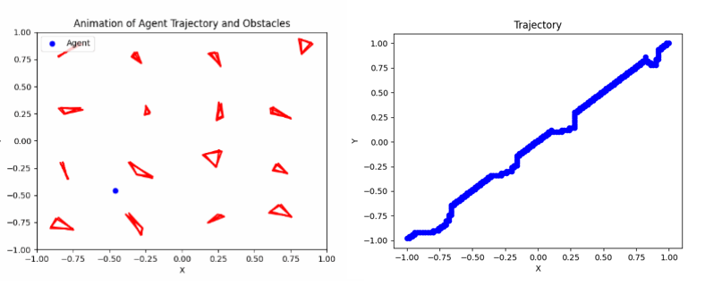

# Trajectory planning with moving obstacle

This project aims to first find an appropriate way to encode dynamic environment with the help of BPS method due to its powerful performance. And then with the encoded information
we make trajectory planning of drones using supervised learning. The target is achieved by adjusted A* Algorithm.

## Dataset

To evaluate a pretrained model or train a new model from scratch, you have to obtain the respective dataset.

In this paper, we generate a complex dynamic environment which contains 16 moving obstacles. The size of each obstacle is randomly generated, and to better simulate the movement in real world, we add some noise in it, such as time-varying velocity and rotation speed.

### Dynamic Environment Generation
To generate dynamic environments, we provide the script `data_preprocessing.py` and `Trajectory_aggregation.py`.

### Ground Truth Generation
To generate the ground truth trajectory for each dynamic environment, we provide the script `astar.py`, which applies the adjusted A* Algorithm.

### Training and Test
For the training of trajectory planning model, we provide the script `motion_planning/train.py`, and for testing, use the script `motion_planning/test.py`.

We also provide a script `motion_planning/visualization.py` for visualisation, we can see how many collisions happen within the trajectory and their position.

